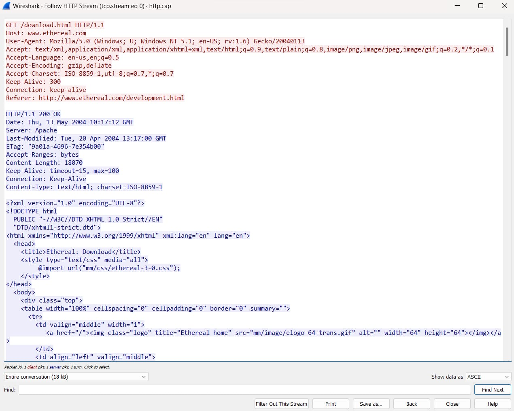

* Dosen Pengampu  
Tugas ini merupakan tugas mata kuliah Konsep Jaringan yang diampu oleh Dr. Ferry Astika Saputra ST, M.Sc ([@ferryastika](https://github.com/ferryastika)).

1. http.cap
HTTP adalah singkatan dari Hypertext Transfer Protocol". Ini adalah protokol yang digunakan untuk mengirimkan data antara klien dan server World Wide Web. HTTP digunakan untuk mengatur cara permintaan dan respon data, terutama dalam konteks halaman web, tetapi juga digunakan dalam berbagai aplikasi berbasis web. 

Analisis Metode: GET. ini menunjukkan bahwa permintaan ini adalah permintaan untuk mengambil(mendownload)halaman atau konten yang diberikan. Path:/download.html. ini adalah bagian dari URL yang menunjukkan alamat spesifik yang diminta. Versi HTTP: HTTP/1.1. Versi protokol HTTP yang digunakan. Host: www.ethereal.com. ini adalah header yang menunjukkan domain yang diminta. Status: 200 OK. Kode status yang menunjukkan bahwa permintaan berhasil. Date: Tanggal dan waktu respons dihasilkan.
2. telnet-cooked.pcap
Telnet adalah sebuah protokol jaringan yang digunakan untuk mengakses dan mengendalikan perangkat jarak jauh melalui jaringan. biasanya, Telnet digunakan untuk mengakses shell atau lingkungan baris perintah pada perangkat jarak jauh seperti sever, router, atau perangkat lainnya yang memiliki kemampuan koneksi jaringan

Analisis login: fake: dalam contoh ini,"fake" adalah nama penggunan yang dimasukkan. Password:user: kata sandi yang dimasukkan adalah "user". ini adalah contoh kata sandi yang dimasukkan oleh pengguna. $ /sbin/ping www.yahoo.com: ini adalah perintah untuk menjalankan test "ping" ke alamat IP 204.71.200.67, yang dihubungkan dengan nama domain www.yahoo.com
3. dns.cap
Protokol DNS (Domain Name System) adalah protokol yang digunakan untuk menerjemahkan nama domain yang mudah diingat menjadi alamat IP numerik yang diperlukan oleh komputer untuk mengidentifikasi dan berkomunikasi satu sama lain dalam jaringan.

Analisis "source" atau sumber adalah komputer atau perangkat yang menginisiasi permintaan DNS. ini biasanya adalah komputer tempat aplikasi, seperti peramban web, berjalan. sumber mengirimkan permintaan DNS ke server DNS untuk mencari tahu alamat IP yang sesuai dengan nama domain yang dimasukkan. "destination" atau tujuan adalah server DNS yang menerima permintaan DNS dari sumber. Server DNS ini bertugas untuk mencari informasi yang diperlukan dalam database DNS
