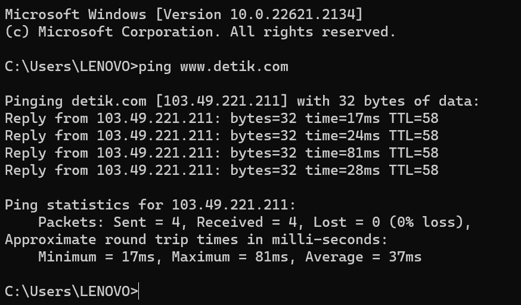
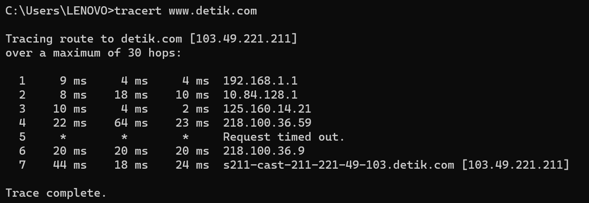

1. Ping
Perintah ping bekerja dengan cara mengirim paket ke alamat yang ditentukan, pengirim paket menunggu balasan dari alamat tersebut. Perjalanan paket dari mulai dikirim dan balik lagi ke pengirim memerlukan waktu. semakin cepat paket kembali ke pengirim, maka semakin bagus koneksi anatara pengirim dan tujuan. Bila melakukan ping ke 2 alamat tujuan yang berbeda dengan memakai jaringan yang sama bisa disimpulkan letak server dari 2 alamat tersebut

Paket Data: Setiap kali Anda menjalankan tes ping, cmd mengirimkan serangkaian paket data ke alamat tujuan yang Anda tentukan. Paket data ini berisi informasi yang diperlukan untuk mengukur respons dari alamat tersebut.
Waktu (Time): Salah satu elemen yang paling penting dalam hasil ping adalah waktu (time) yang diperlukan untuk setiap paket data untuk pergi ke alamat tujuan dan kembali lagi ke komputer Anda. Ini diukur dalam milisecond (ms) dan menunjukkan berapa lama perjalanan pulang-pergi paket data tersebut.
TTL (Time To Live): TTL adalah nilai yang ditambahkan ke setiap paket data yang dikirim. Nilai ini menurun setiap kali paket data melewati perangkat jaringan seperti router. Jika TTL mencapai nol, paket data akan dibuang. Informasi TTL dapat memberikan gambaran tentang jumlah "langkah" atau router yang diperlukan untuk mencapai alamat tujuan.
2. Traceroute
Traceroute merupakan perintah untuk menunjukkan rute yang dilewati paket untuk mencapai tujuan. Ini dilakukan dengan mengirim pesan Internet Control Message Protocol (ICMP) Echo Request Ke tujuan dengan nilai Time to Live yang semakin meningkat. Rute yang ditampilkan adalah daftar interface router (yang paling dekat dengan host) yang terdapat pada jalur antara host dan tujuan.

Hop: Setiap langkah dalam perjalanan paket data dari komputer Anda ke alamat tujuan disebut sebagai "hop." Setiap hop mewakili perangkat jaringan seperti router yang ditemui oleh paket data dalam perjalanan menuju tujuan.
Waktu (Time): Seperti pada perintah "ping," waktu (time) di sini menunjukkan berapa lama dibutuhkan oleh setiap paket data untuk mencapai hop berikutnya. Ini diukur dalam milisecond (ms) dan menunjukkan latensi pada setiap hop.
Nama Host atau Alamat IP: Untuk setiap hop, Anda akan melihat nama host (jika tersedia) atau alamat IP perangkat jaringan yang ada di hop tersebut. Ini membantu Anda memahami jalur perjalanan data dan mengidentifikasi perangkat jaringan tertentu.
