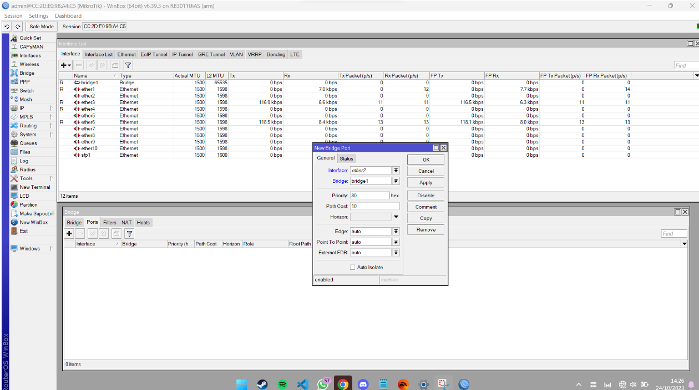
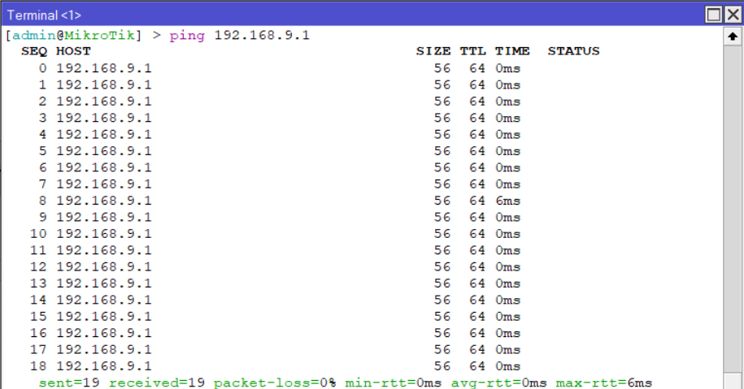

* Dosen Pengampu  
Tugas ini merupakan tugas mata kuliah Konsep Jaringan yang diampu oleh Dr. Ferry Astika Saputra ST, M.Sc ([@ferryastika](https://github.com/ferryastika)).
# Mikrotik Winbox
Winbox adalah sebuah aplikasi manajemen berbasis GUI (Graphical User Interface) yang dikembangkan oleh MikroTik. Aplikasi ini digunakan untuk mengkonfigurasi, mengelola, dan memantau perangkat MikroTik RouterOS. 

# Konfigurasi Mikrotik via Winbox

# Percobaan ping ke Kelompok lain

