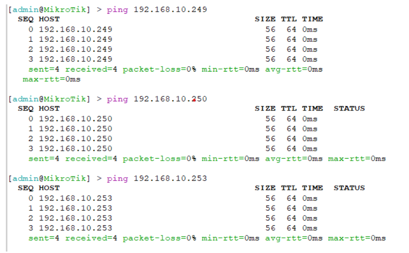
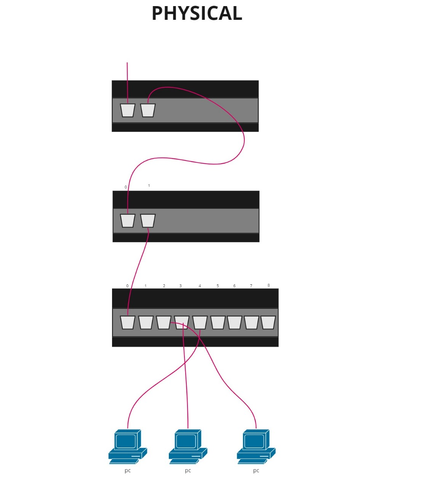
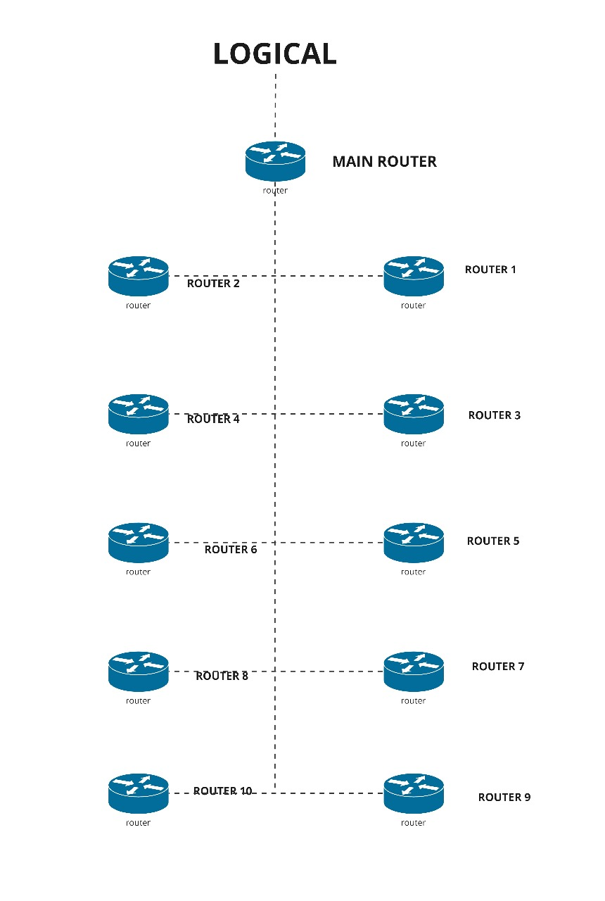
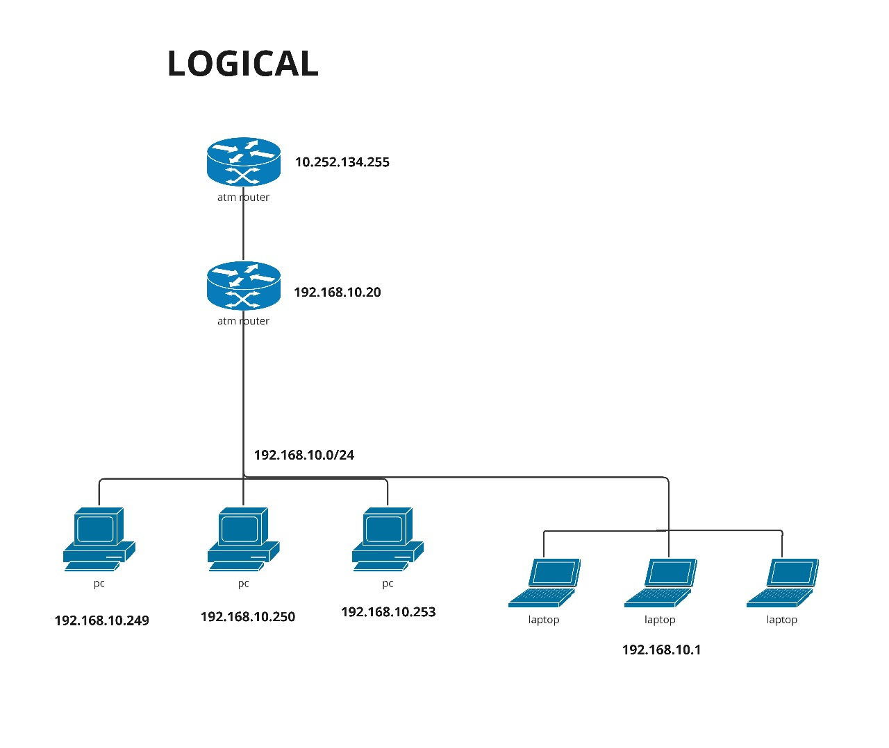

* Dosen Pengampu  
Tugas ini merupakan tugas mata kuliah Konsep Jaringan yang diampu oleh Dr. Ferry Astika Saputra ST, M.Sc ([@ferryastika](https://github.com/ferryastika)).
# 1. Ping Antar PC

Untuk penugasan yang pertama yaitu menentukan IP sesuai dengan Router yang ada di Server Rack. Dapat dilakukan dengan cara yang pertama yaitu melihat apakah PC 1 terhubung dengan slot Router yang ada di Server

# 2. Physical Route

Gambar di atas merupakan contoh simulasi Physical dari percobaan yang telah dilakukan

# 3a. Logical Route (Semua Kelompok)

Gambar di atas merupakan contoh simulasi Logical Route dari percobaan yang telah dilakukan.

# 3b. Logical Route (Satu Kelompok)

Gambar di atas merupakan contoh simulasi Logical Route dari percobaan yang telah dilakukan.

# 4. Routing Table

Secara sederhana, Routing Table adalah panduan yang digunakan dalam jaringan untuk menentukan jalur terbaik yang harus diambil oleh data untuk mencapai tujuannya
