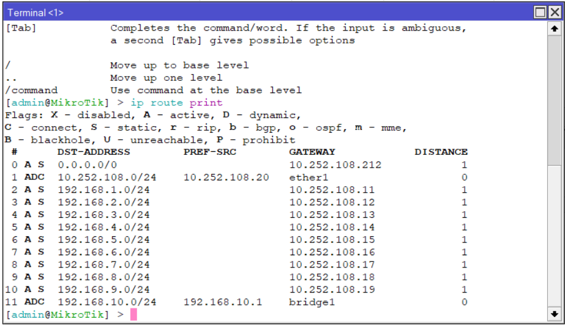

# 1. Ping Antar PC

Untuk penugasan yang pertama yaitu menentukan IP sesuai dengan Router yang ada di Server Rack. Dapat dilakukan dengan cara yang pertama yaitu melihat apakah PC 1 terhubung dengan slot Router yang ada di Server
# 2. Physical Route

Gambar di atas merupakan contoh simulasi Physical dari percobaan yang telah dilakukan
# 3a. Logical Route (Semua Kelompok)

Gambar di atas merupakan contoh simulasi Logical Route dari percobaan yang telah dilakukan.
# 3b. Logical Route (Satu Kelompok)

Gambar di atas merupakan contoh simulasi Logical Route dari percobaan yang telah dilakukan.
# 4. Routing Table

Secara sederhana, Routing Table adalah panduan yang digunakan dalam jaringan untuk menentukan jalur terbaik yang harus diambil oleh data untuk mencapai tujuannya