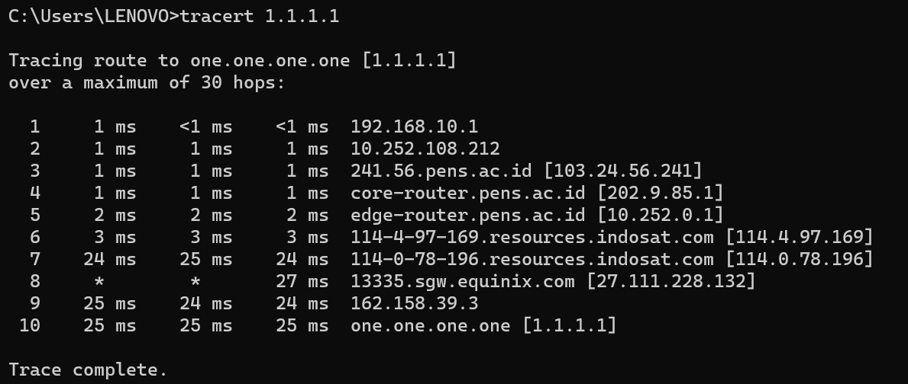
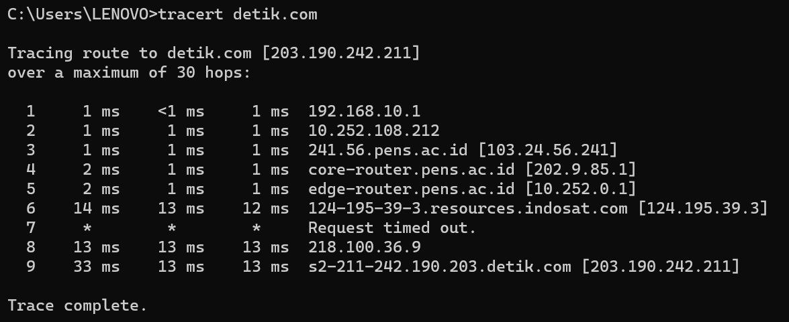

# TraceRoute ke 1.1.1.1

Hop 1: 192.168.10.1
Waktu respons sangat cepat, <1 ms. Ini menunjukkan bahwa hop ini adalah router atau perangkat jaringan lokal yang berdekatan dengan titik awal.
Hop 2: 10.252.108.212
Respons yang sangat cepat, <1 ms. Kemungkinan merupakan perangkat jaringan lokal atau router.
Hop 3: 241.56.pens.ac.id [103.24.56.241]
Respons yang sangat cepat, <1 ms. Nampaknya merupakan alamat IP dari sebuah lembaga pendidikan (PENS).
Hop 4: core-router.pens.ac.id [202.9.85.1]
Respons yang baik, 1 ms. Kemungkinan merupakan router inti di lembaga pendidikan.
Hop 5: edge-router.pens.ac.id [10.252.0.1]
Respons yang baik, 1-2 ms. Mungkin merupakan router tepi di lembaga pendidikan.
Hop 6: 114-4-97-169.resources.indosat.com [114.4.97.169]
Hop 7: 114-0-78-196.resources.indosat.com [114.0.78.196]
Hop 8: 13335.sgw.equinix.com [27.111.228.132]
Seluruh hop ini menunjukkan respon yang baik, walaupun pada percobaan kedua dan ketiga, Hop 8 mengalami time-out. Mungkin ada konfigurasi di hop ini yang mencegah respons terhadap traceroute.
Hop 9: 162.158.39.3
Hop 10: one.one.one.one [1.1.1.1]
Respon yang baik, sekitar 25 ms. Ini adalah server DNS 1.1.1.1 dari Cloudflare.

Hop 1 - Hop 5
Respons yang baik, <2 ms, melalui jaringan lokal dan lembaga pendidikan.
Hop 6: 124-195-39-3.resources.indosat.com [124.195.39.3]
Hop 7: RTO
Hop 8 : 218.100.36.9
Hop 9: s2-211-242.190.203detik.com [203.190.242.211]
Respon yang baik, sekitar 14-18 ms. Ini adalah server detik.com.
Kesimpulan:
Sebagian besar hop menunjukkan respons yang baik dan sesuai dengan harapan.
Beberapa time-out pada hop tertentu (terutama Hop 8) mungkin disebabkan oleh kebijakan konfigurasi di perangkat jaringan tersebut.
Jarak geografis dan jenis layanan mungkin mempengaruhi waktu respons antar hop.
Meskipun terdapat beberapa time-out, jika pengguna tidak mengalami masalah koneksi atau kinerja, ini mungkin dapat diabaikan.
Jika ada masalah koneksi atau kinerja yang dirasakan, langkah selanjutnya adalah berkoordinasi dengan penyedia layanan internet atau administrator jaringan setempat untuk menilai dan mengatasi masalah tersebut.