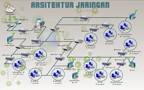

* Dosen Pengampu  
Tugas ini merupakan tugas mata kuliah Konsep Jaringan yang diampu oleh Dr. Ferry Astika Saputra ST, M.Sc ([@ferryastika](https://github.com/ferryastika)).

# Arsitektur jaringan kampus 
desain dan struktur jaringan yang digunakan dalam lingkungan kampus atau universitas. Arsitektur ini mencakup infrastruktur jaringan yang menghubungkan berbagai bangunan, departemen, laboratorium, perpustakaan, ruang kelas, pusat data, dan area lainnya di dalam lingkungan kampus.

Berikut adalah beberapa komponen utama yang sering ada dalam arsitektur jaringan kampus:
1. Topologi Jaringan:
* Hierarkis: Biasanya menggunakan pendekatan hierarkis dengan lapisan yang terdiri dari core layer distribution layer, dan access layer. Core layer menangani lalu lintas data yang besar antara area-area dalam kampus. Distribution layer mengelola lalu lintas antara core dan access layer. Access layer adalah titik akses terhadap pengguna dan perangkat di jaringan.
* Campuran Kabel dan Nirkabel: Terdapat kombinasi infrastruktur kabel (ethernet, fiber optic) dan nirkabel (Wi-Fi) untuk menyediakan konektivitas yang lebih luas dan mudah diakses di seluruh kampus.

2. Perangkat Khusus:
* Router dan Switch: Digunakan untuk mengatur lalu lintas data di berbagai lapisan jaringan.
Firewall dan Sistem Keamanan: Penting untuk melindungi jaringan dari serangan luar dan memastikan keamanan data.

3. Layanan dan Aplikasi:
* Sistem Manajemen Jaringan (NMS): Digunakan untuk memantau dan mengelola perangkat jaringan secara efisien.
* Layanan VoIP (Voice over Internet Protocol): Memberikan layanan telepon digital melalui jaringan IP.
Sistem Informasi Akademik: Aplikasi khusus untuk manajemen akademik dan administrasi kampus.

4. Keamanan:
* Segmentasi Jaringan: Pembagian jaringan ke dalam zona-zona keamanan untuk mengisolasi data sensitif dari akses yang tidak sah.
* Otentikasi Pengguna: Pengguna harus melewati proses otentikasi untuk mengakses jaringan, dan mungkin menggunakan protokol keamanan seperti VPN untuk mengakses sumber daya dari luar jaringan kampus.

5. Skalabilitas dan Redundansi:
* Skalabilitas: Desain jaringan harus dapat diubah sesuai kebutuhan untuk menambahkan atau mengurangi sumber daya jaringan dengan mudah.
* Redundansi: Penggunaan jalur-jalur cadangan dan perangkat backup untuk menghindari gangguan layanan jika ada kegagalan pada perangkat utama.

Arsitektur jaringan kampus dirancang untuk mendukung kebutuhan akses yang cepat, aman, dan andal bagi pengguna di kampus, serta memberikan infrastruktur yang dapat diandalkan untuk aplikasi dan layanan yang digunakan dalam lingkungan pendidikan dan administrasi.

