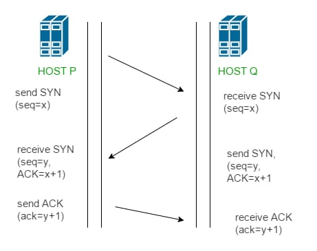

1. 3 way handshaking adalah metode yang digunakan dalam jaringan TCP/IP untuk membuat koneksi antara host/klien dan server lokal. Ini adalah metode tiga langkah yang dirancang untuk memungkinkan kedua ujung yang berkomunikasi untuk memulai dan menegosiasikan parameter koneksi soket TCP jaringan secara bersamaan sebelum data seperti HTTP dan SSH ditransmisikan. Beberapa koneksi soket TCP dapat ditransmisikan di kedua arah secara bersamaan.
3 way handshaking arah juga dikenal sebagai jabat tangan TCP atau syn-syn-ack, dan mengharuskan klien dan server untuk bertukar paket (sinkronisasi) dan ACK (pengakuan) sebelum komunikasi data aktual dimulai. Bahkan, namanya berasal dari tiga pesan yang dikirimkan oleh TCP sebelum sesi antara kedua ujungnya dimulai.
3 way handshaking terutama digunakan untuk membuat koneksi soket TCP untuk secara andal mengirimkan data antar perangkat. Misalnya, ini mendukung komunikasi antara browser web di sisi klien dan server setiap kali pengguna menavigasi internet. Segera setelah klien meminta sesi komunikasi dengan server, proses 3 way handshaking memulai lalu lintas TCP dengan mengikuti tiga langkah. Tiga langkah 3 way handshaking
Langkah 1: Koneksi antara server dan klien dibuat Pertama, koneksi antara server dan klien dibuat, sehingga server target harus memiliki port terbuka yang dapat menerima dan memulai koneksi baru. Node klien mengirimkan paket data syn (sinkronisasi nomor urutan) melalui jaringan IP ke server pada jaringan yang sama atau eksternal.Paket syn ini adalah nomor urutan acak yang ingin digunakan klien untuk komunikasi (misalnya, x). Tujuan dari paket ini adalah untuk bertanya/menyimpulkan apakah server terbuka untuk koneksi baru.
Langkah 2: Server menerima paket syn dari node klien Ketika server menerima paket SYN dari node klien, ia merespons dan mengembalikan tanda terima konfirmasi - paket ACK (Nomor Urutan Ucapan Terima Kasih) atau paket SYN/ACK. Paket ini mencakup dua nomor urutan. Yang pertama adalah ACK One, yang ditetapkan oleh server ke satu lebih dari nomor urutan yang diterima dari klien (mis.X+1). Yang kedua adalah syn yang dikirim oleh server, yang merupakan nomor urutan acak lainnya (misalnya, y). Urutan ini menunjukkan bahwa server dengan benar mengakui paket klien, dan itu mengirimnya sendiri untuk diakui juga.
Langkah 3: Node Klien Menerima Syn/ACK dari server dan merespons dengan paket ACK. Node klien menerima syn/ack dari server dan merespons dengan paket ACK. Sekali lagi, masing -masing pihak harus mengakui nomor urutan yang diterima dengan bertambah satu. Jadi sekarang pergantian klien untuk mengakui paket server dengan menambahkan satu ke nomor urutan (dalam hal ini, y+1), dan mengirimkannya ke server. Setelah menyelesaikan proses ini, koneksi dibuat dan host dan server dapat berkomunikasi. Semua langkah ini diperlukan untuk memverifikasi nomor seri yang berasal dari kedua sisi, menjamin stabilitas koneksi. Karena kedua host harus mengakui parameter koneksi dari sisi lain, segmen yang hilang atau di luar orde dapat dengan cepat terdeteksi sebelum proses transfer data aktual dimulai.