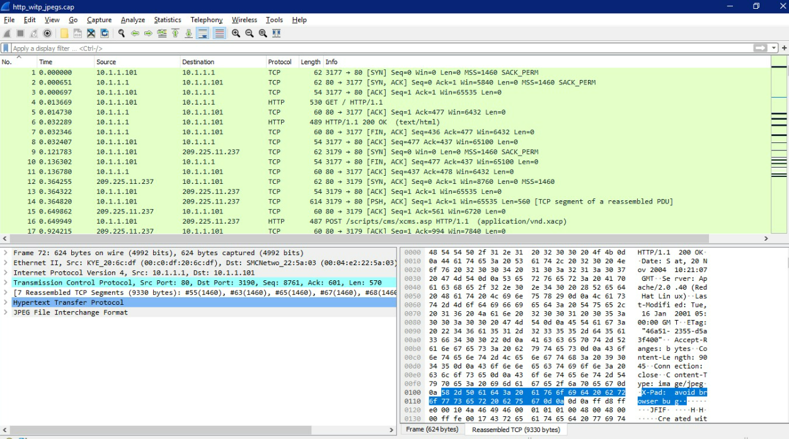
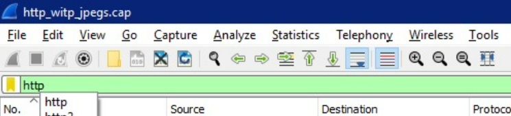
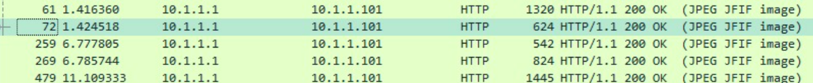
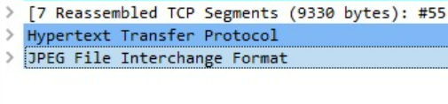
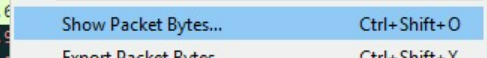
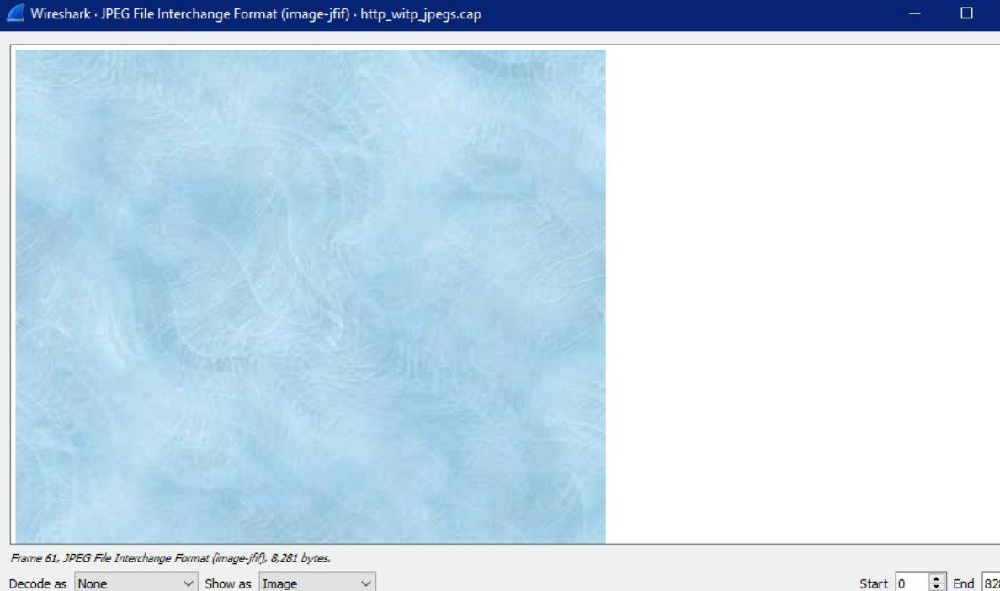
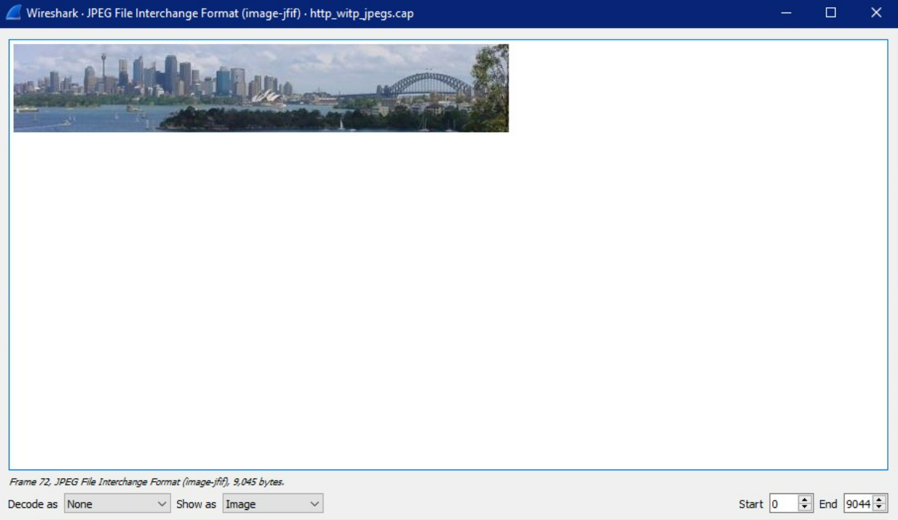
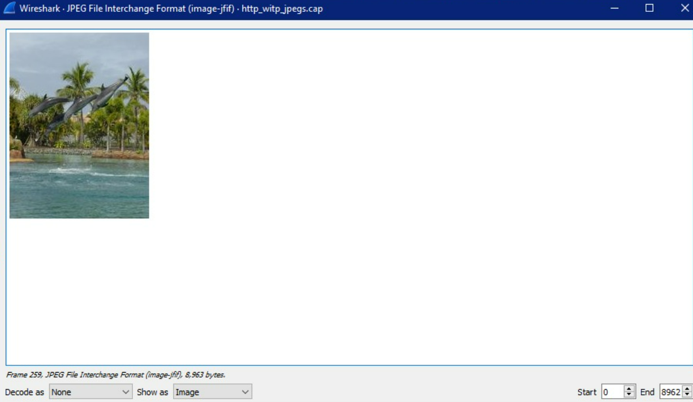
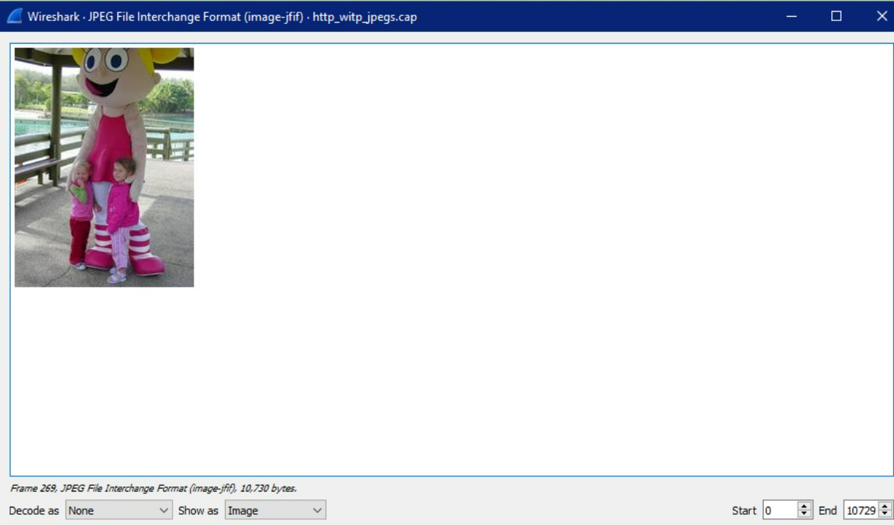
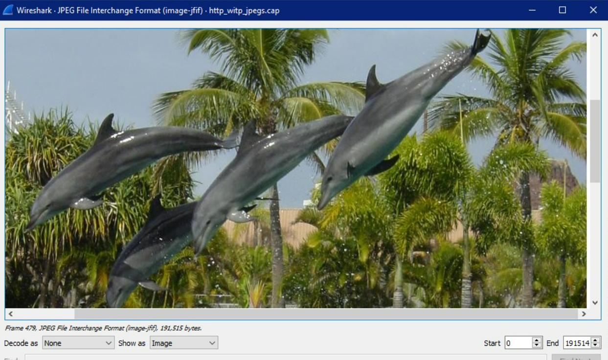

- CARA MENEMUKAN GAMBAR DI HTTP_WITP_JPEG.CAP
1. Buka file http_witp_jpegs.cap

2. Tambahkan filter dengan keyword "http" agar yang tampil list http protocol saja

3. Lalu cari Frame seperti dibawah ini

4. Klik kanan pada "JPEG File Intercharge Format lalu Show Packet Bytes"

5. Berikut tampilan isi dari tiap-tiap frame

