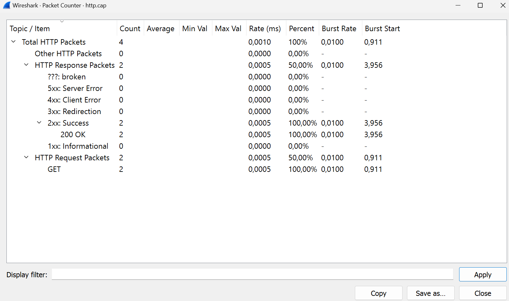

* Dosen Pengampu  
Tugas ini merupakan tugas mata kuliah Konsep Jaringan yang diampu oleh Dr. Ferry Astika Saputra ST, M.Sc ([@ferryastika](https://github.com/ferryastika)).

1. ada 4 paket HTTP yang direkam, semuanya terkait dengan lalu lintas HTTP. Dari 4 paket ini, 2 adalah permintaan (request) HTTP yang semuanya menggunakan metode GET. Sisanya adalah respon dari server web, dengan semua respon memiliki kode status HTTP dalam kategori 2xx (keberhasilan), khususnya "200 OK".
2. Burst rate untuk baik permintaan GET maupun respon adalah 0.0100 paket per detik, dengan burst rate pertama kali dimulai pada saat yang berbeda (0.911 detik untuk permintaan GET dan 3.956 detik untuk respon).
3. Laju masuk rata-rata adalah 0.0005 paket per milidetik. Jadi, capture ini menunjukkan bahwa terdapat pertukaran data HTTP yang terutama terdiri dari permintaan GET dan respon 200 OK yang berhasil
