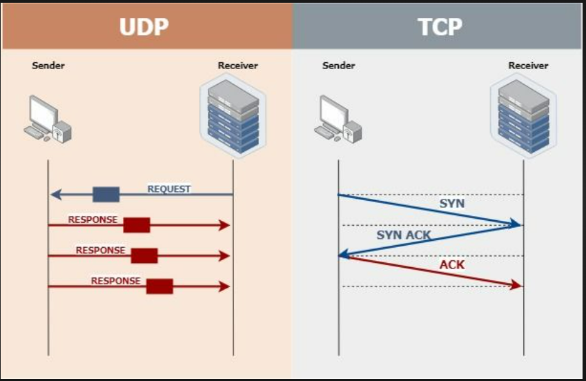

Port dalam konteks komunikasi jaringan merujuk pada mekanisme yang digunakan oleh sistem operasi dan perangkat jaringan untuk mengidentifikasi aplikasi atau layanan tertentu yang berkomunikasi melalui jaringan. Port adalah alamat numerik yang digunakan untuk mengarahkan data ke aplikasi yang benar di dalam sebuah perangkat.
Port dapat digunakan baik untuk protokol TCP (Transmission Control Protocol) maupun UDP (User Datagram Protocol) karena kedua protokol ini adalah bagian dari lapisan transport dalam model OSI (Open Systems Interconnection) dan memiliki perbedaan karakteristik yang membuat mereka cocok untuk situasi yang berbeda.
Berikut adalah beberapa perbedaan antara TCP dan UDP yang dapat menjelaskan mengapa port dapat digunakan untuk keduanya:

1. **TCP (Transmission Control Protocol)**:
   - Protokol yang terkait dengan koneksi berorientasi.
   - Memastikan pengiriman data yang andal dengan tanda terima dan pengiriman ulang jika ada kehilangan paket.
   - Digunakan untuk aplikasi yang memerlukan pengiriman data yang konsisten, seperti web browsing, email, dan transfer file.

2. **UDP (User Datagram Protocol)**:
   - Protokol yang berbasis datagram tanpa koneksi.
   - Tidak memastikan pengiriman data yang andal atau pengiriman dalam urutan tertentu.
   - Digunakan untuk aplikasi yang memerlukan latensi rendah dan di mana sedikit atau tidak ada penanganan kesalahan yang diperlukan, seperti video streaming, VoIP (Voice over IP), dan game online.

Port, dalam konteks ini, berfungsi sebagai cara untuk mengarahkan data ke aplikasi yang benar di dalam perangkat, terlepas dari protokol yang digunakan. Ini memungkinkan fleksibilitas dalam komunikasi, di mana aplikasi dapat memilih menggunakan TCP atau UDP berdasarkan persyaratan khususnya. Sebagai contoh, HTTP (protokol untuk web) dapat menggunakan port 80 untuk TCP dan port 8080 untuk UDP jika aplikasi tersebut telah dikonfigurasi untuk melakukannya.
Jadi, port dapat digunakan baik untuk TCP maupun UDP karena keduanya adalah protokol yang berbeda dengan karakteristik yang berbeda, tetapi keduanya dapat mengidentifikasi aplikasi yang benar yang akan menerima data yang dikirimkan.
