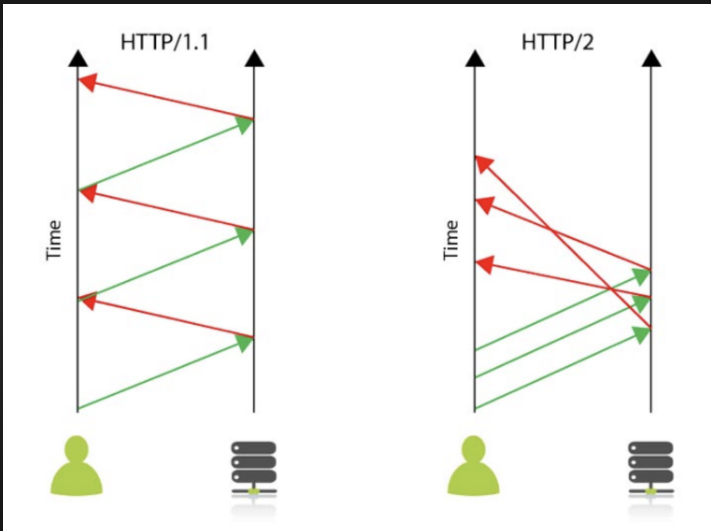

* Dosen Pengampu  
Tugas ini merupakan tugas mata kuliah Konsep Jaringan yang diampu oleh Dr. Ferry Astika Saputra ST, M.Sc ([@ferryastika](https://github.com/ferryastika)).

# TRANSFORMASI HTTP VERSION

# HTTP 0.9
-  **Penjelasan** adalah versi awal HTTP yang sangat sederhana. hanya mendukung metode GET. Permintaan HTTP hanya terdiri dari kata kunci "GET", alamat dan versi protokol.
-  **Contoh Penerapan**  HTTP 0.9: GET/index.html
-  **Perubahan Utama** Tidak ada header HTTP dan tidak ada respons HTTP yang resmi
-  **Keunggulan Utama** Sederhana dan mudah diimplementasikan.
 

# HTTP 1.0
-  **Penjelasan** HTTP 1.0 memperkenalkan fitur-fitur seperti header permintaan HTTP, berbagai metode HTTP (GET,POST,dsb), serta dukungan untuk koneksi persisten(Keep-Alive).
-  **Contoh Penerapan**  
- HTTP 1.0: GET/index.html 
- HTTP 1.0 Host: www.test.com
-  **Perubahan Utama** Dukungan untuk header HTTP dan berbagai metode. Dan kemampuan koneksi persisten.
-  **Keunggulan Utama** Dapat mengirimkan permintaan HTTP yang lebih kompleks
 

# HTTP 1.1
-  **Penjelasan** HTTP 1.1 menghadirkan peningkatan signifikan dalam performa dan efisiensi. dan Memperkenalkan koneksi persisten secara default, sehingga mengurangi overhead pembukaan/ketutupan koneksi.
-  **Contoh Penerapan**  
- HTTP 1.1: GET/index.html 
- HTTP 1.1 Host: www.test.com
-  **Perubahan Utama** Koneksi persisten secara default dan HTTP Pipelining.
-  **Keunggulan Utama** Kinerja yang lebih baik melalui pengurangan latensi.
 

# HTTP 2.0
-  **Penjelasan** HTTP 2.0 versi terbaru yang menghadirkan transformasi besar. - Menggunakan multiplexing untuk mengirim banyak permintaan/respons melalui satu koneksi.
-  **Contoh Penerapan**  
- HTTP 2.0: GET/index.html 
- HTTP 2.0 Host: www.test.com
-  **Perubahan Utama** Multiplexing, Kompresi header dan Prioritisasi
-  **Keunggulan Utama** Pengiriman yang lebih cepat melalui multiplexing dan Penghematan bandwidth dengan kompresi header
 

# HTTP 3.0
-  **Penjelasan** HTTP 3.0 merupakan internet-Draft, berbeda dengan versi HTTP sebelumnya yang merupakan dokumen request for comments
-  **Contoh Penerapan**  
- HTTP 3.0: GET/index.html 
- HTTP 3.0 Host: www.test.com
-  **Perubahan Utama** Dari Protokol lapisan transport yang digunakan
-  **Keunggulan Utama** Dirancang melalui QUIC (Quick UDP internet Connections).
 

## TCP Keep-Alive dalam HTTP

TCP Keep-Alive adalah fitur yang ditemukan dalam protokol transport TCP yang digunakan oleh HTTP. Fitur ini memiliki keunggulan besar dibandingkan dengan versi HTTP sebelumnya yang tidak menggunakan koneksi persisten (Keep-Alive).TCP Keep-Alive adalah mekanisme yang memungkinkan klien dan server untuk menjaga koneksi jaringan terbuka setelah pertukaran awal permintaan dan respons.

### Keunggulan TCP Keep-Alive:

1. Dengan TCP Keep-Alive, koneksi tetap terbuka setelah respons pertama, mengurangi latensi saat melakukan permintaan berikutnya. Pada HTTP tanpa Keep-Alive, setiap permintaan akan memerlukan pembukaan koneksi baru, yang bisa memakan waktu.

2. Mencegah overhead pembukaan dan penutupan koneksi yang berulang-ulang, sehingga menghemat sumber daya jaringan dan server.

3. Dengan koneksi terbuka, pengguna dapat mengirimkan beberapa permintaan HTTP melalui koneksi yang sama tanpa harus membuka koneksi baru setiap saat. Ini mengoptimalkan kinerja dan pengiriman data.

### Contoh Penggunaan:

- Ketika Anda membuka situs web yang menggunakan TCP Keep-Alive, setelah mengunduh sumber daya awal (seperti HTML), permintaan tambahan seperti gambar, CSS, atau skrip JavaScript dapat dimuat melalui koneksi yang sama tanpa harus membuka koneksi baru untuk setiap elemen. Ini menghasilkan peningkatan signifikan dalam waktu pemuatan halaman.
