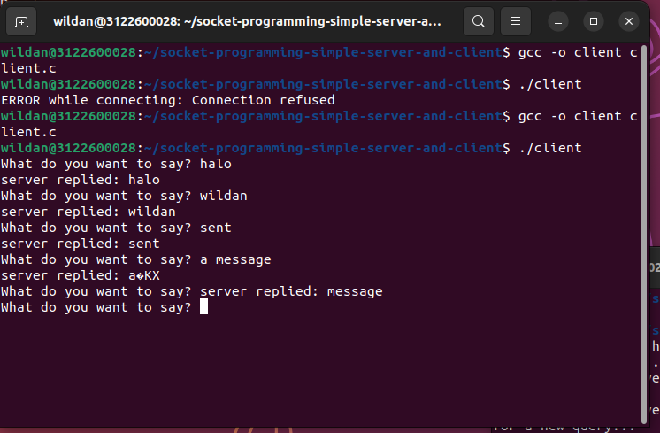
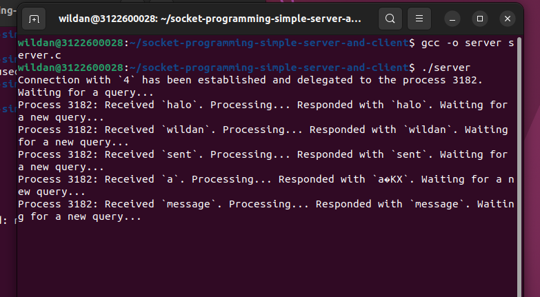

* Dosen Pengampu  
Tugas ini merupakan tugas mata kuliah Konsep Jaringan yang diampu oleh Dr. Ferry Astika Saputra ST, M.Sc ([@ferryastika](https://github.com/ferryastika)).

1. Variabel-variabel: Kode ini menetapkan beberapa variabel yang akan digunakan dalam program, seperti sockfd (file descriptor untuk soket), portno (nomor port yang akan digunakan untuk menghubungkan ke server), dan buffer (tempat untuk mengirim dan menerima data).
2. Membuat Soket: Kode ini menggunakan fungsi 'socket' untuk membuat soket. Fungsi ini menghasilkan deskriptor berkas yang akan digunakan untuk komunikasi jaringan. Soket yang dibuat adalah soket TCP (SOCK_STREAM) dalam domain AF_INET (IPv4).
3. Mendapatkan Informasi Server: Kode ini menggunakan 'gethostbyname' untuk mendapatkan informasi tentang server yang akan dihubungi. Pada contoh ini, server yang dihubungi adalah 127.0.0.1 (localhost), sehingga alamat IP tersebut digunakan.
4. Menginisialisasi Struktur serv_addr: Struktur 'serv_addr' digunakan untuk menyimpan alamat server yang akan dihubungi. Kode ini mengisi struktur tersebut dengan alamat IP server dan nomor port yang telah ditentukan.
5. Menghubungkan ke Server: Kode ini menggunakan 'connect' untuk menghubungkan klien ke server yang telah ditentukan. Jika koneksi berhasil, klien akan terhubung ke server.
