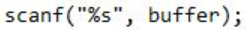

1. QUit
   

- Saat client menerima pesan "quit" dari server, client akan keluar dari loop dan mengakhiri program. Ini berarti client akan menutup koneksi sepenuhnya (full close). - Penutupan penuh ini mengindikasikan bahwa client tidak akan mengirim atau menerima data lagi melalui koneksi tersebut, dan sumber daya jaringan akan dibebaskan setelah program client berakhir. Jadi, koneksi akan ditutup sepenuhnya (full closed) setelah client menerima pesan "quit" dari server.
2. Close
  

- Ketika client mengetikkan "close" dan mengirimkannya ke server, client hanya mengirim pesan "close" ke server melalui koneksi. Koneksi itu sendiri tidak akan ditutup sepenuhnya oleh client, tetapi hanya sisi pengiriman data (half close) dari sisi client. - Ini berarti client masih dapat menerima respons atau pesan lain dari server melalui koneksi tersebut, tetapi client tidak akan mengirim pesan lebih lanjut ke server melalui koneksi tersebut.
  

- Jadi, jika server mendeteksi pesan "close" dari client, server akan menutup koneksi ke client, sehingga koneksi akan menjadi setengah (half closed) dari sisi server. Koneksi akan tetap terbuka dari sisi client hingga client juga menutupnya secara eksplisit atau hingga terjadi kesalahan pada koneksi.
