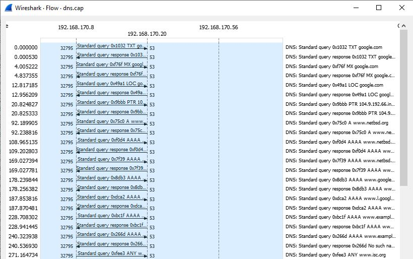

* Dosen Pengampu  
Tugas ini merupakan tugas mata kuliah Konsep Jaringan yang diampu oleh Dr. Ferry Astika Saputra ST, M.Sc ([@ferryastika](https://github.com/ferryastika)).

1. Pengertian DNS
DNS adalah singkatan dari Domain Name System. Ini adalah protokol yang digunakan di internet untuk menghubungkan nama domain (seperti www.google.com) ke alamat IP (seperti 192.168.1.7) yang sesuai. DNS adalah komponen penting dalam infrastruktur internet karena memungkinkan pengguna untuk mengakses situs web dan layanan online dengan menggunakan nama domain yang mudah diingat, alih-alih harus mengingat alamat IP numerik yang rumit.
2. Cara Kerja DNS
- Permintaan DNS: Ketika Anda memasukkan nama domain ke dalam browser web atau aplikasi, perangkat Anda akan mengirim permintaan DNS ke server DNS lokal atau server DNS yang ditentukan.
- Caching DNS: Server DNS lokal akan memeriksa apakah itu memiliki informasi tentang nama domain yang diminta dalam cache-nya. Jika ada, maka alamat IP akan dikembalikan tanpa melakukan permintaan ke server DNS lain.
- Recursive DNS: Jika server DNS lokal juga tidak memiliki rekaman DNS yang sesuai dalam cache atau dalam basis data otoritatif, maka server DNS lokal akan bertindak sebagai server DNS rekursif. Ini berarti server akan melakukan pencarian DNS yang lengkap untuk menemukan alamat IP yang sesuai.
- Balasan DNS: Setelah informasi alamat IP ditemukan, server DNS akan mengirimkannya kembali ke perangkat pengguna. Dari sini, perangkat dapat menggunakan alamat IP ini untuk membuat koneksi dengan server yang dituju.
3. Analisis Flowgraph DNS

- Permintaan DNS (UDP): Pada tahap ini, komputer pengguna mengirimkan permintaan DNS (Domain Name System) menggunakan protokol UDP (User Datagram Protocol) ke server DNS. Permintaan ini berisi informasi tentang nama domain yang ingin diresolusi, seperti "www.example.com." Permintaan DNS ini adalah langkah pertama dalam mencari alamat IP yang sesuai dengan nama domain yang diminta.
- Respons DNS (UDP): Setelah menerima permintaan DNS, server DNS mencari alamat IP yang sesuai dengan nama domain yang diminta. Setelah menemukannya, server DNS mengirimkan respons DNS menggunakan protokol UDP ke komputer pengguna. Respons ini berisi alamat IP yang sesuai dengan nama domain yang diminta. Tahap ini menandai akhir dari proses resolusi DNS untuk permintaan tersebut, dan komputer pengguna dapat menggunakan alamat IP ini untuk mengakses situs web atau layanan yang diinginkan.
