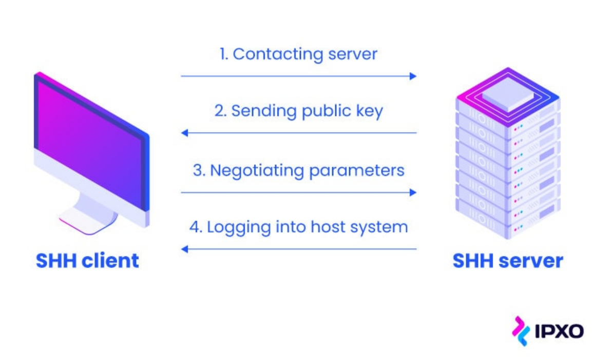

* Dosen Pengampu  
Tugas ini merupakan tugas mata kuliah Konsep Jaringan yang diampu oleh Dr. Ferry Astika Saputra ST, M.Sc ([@ferryastika](https://github.com/ferryastika)).

1. Pengertian SSH(Secure Shell)
SSH (Secure Shell) adalah protokol jaringan yang digunakan untuk mengakses dan mengelola perangkat jarak jauh dan komputer melalui jaringan yang tidak aman, seperti internet. Ini adalah cara yang aman untuk mengendalikan perangkat dan melakukan transfer data dengan mengenkripsi lalu lintas jaringan, sehingga melindungi kerahasiaan dan integritas informasi. SSH menyediakan lingkungan yang aman untuk menjalankan perintah, mengelola file, dan mengakses aplikasi jarak jauh.
2. Pengertian RFC (Request For Comment)
RFC (Request for Comments) yang menggambarkan protokol SSH adalah RFC 4251 hingga RFC 4254. RFC-nya mencakup berbagai aspek protokol, termasuk spesifikasi teknis dan detail implementasi.
3. Versi SSH
- SSH-1: Adalah versi asli dari SSH dan dijelaskan dalam RFC 4251 hingga RFC 4254. Versi ini memiliki beberapa kerentanannya dan sebaiknya tidak digunakan lagi karena sudah tidak aman.
- SSH-2: Adalah versi yang lebih baru dan aman dari SSH, yang dijelaskan dalam RFC 4251 hingga RFC 4254. SSH-2 memiliki peningkatan keamanan dan dukungan yang lebih baik untuk berbagai fitur.
4. Karakteristik
- Enkripsi: SSH menggunakan enkripsi untuk melindungi data yang dikirim antara perangkat, sehingga data tetap rahasia bahkan jika disadap.
- Otentikasi Kuat: SSH memerlukan otentikasi pengguna yang kuat. Ini dapat mencakup metode otentikasi dengan kata sandi atau, yang lebih aman, penggunaan kunci SSH.
- Portabilitas: SSH dapat digunakan di berbagai sistem operasi dan arsitektur, menjadikannya protokol yang sangat portabel.
- Kontrol Akses: SSH memungkinkan pengguna untuk mengendalikan akses ke perangkat jarak jauh dengan menentukan siapa yang diizinkan untuk masuk.
- Forwarding Port: SSH juga mendukung fitur port forwarding, yang memungkinkan pengguna untuk mengirim lalu lintas dari satu port lokal ke port lain di perangkat jarak jauh atau sebaliknya.
