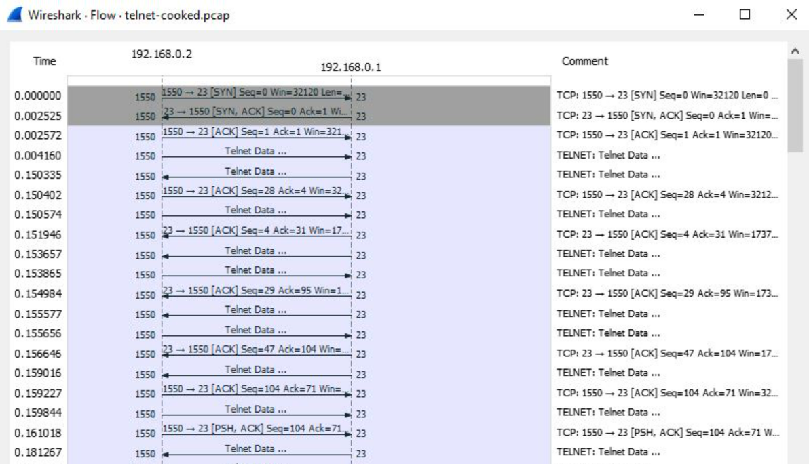

1. Pengertian Telnet
Telnet adalah sebuah protokol jaringan yang digunakan untuk mengakses dan mengendalikan perangkat jarak jauh melalui jaringan komputer. Protokol ini memungkinkan pengguna untuk melakukan akses jarak jauh ke perangkat seperti server, router, atau komputer lainnya, seolah-olah mereka sedang duduk di depan perangkat tersebut secara fisik. Telnet menggunakan koneksi TCP/IP (Transmission Control Protocol/Internet Protocol) untuk mentransmisikan data antara komputer pengguna (client) dan komputer tujuan (server) melalui jaringan.
2. Cara Kerja Telnet
- Inisiasi Koneksi: Klien Telnet (biasanya disebut sebagai "Telnet client") menginisiasi koneksi dengan server Telnet (biasanya disebut sebagai "Telnet server") menggunakan IP address atau nama host server dan nomor port yang sesuai (biasanya port 23). Ini bisa dilakukan melalui perintah seperti telnet [IP_address] [port] pada baris perintah (command line) atau dengan menggunakan perangkat lunak khusus.
- Permintaan Login: Setelah koneksi berhasil dibuat, server Telnet biasanya akan meminta pengguna untuk melakukan login dengan mengirimkan pesan "login:" atau serupa. Pengguna kemudian diminta untuk memasukkan nama pengguna (username) dan kata sandi (password).
- Autentikasi: Setelah pengguna memasukkan nama pengguna dan kata sandi, server Telnet akan memeriksa kredensial ini dengan basis data pengguna yang ada. Jika kredensial valid, pengguna akan diizinkan untuk mengakses sistem. Jika tidak, mereka mungkin akan mendapatkan pesan kesalahan atau kesempatan lain untuk mencoba lagi.
- Interaksi dengan Sistem: Setelah berhasil login, pengguna dapat berinteraksi dengan sistem yang terhubung melalui koneksi Telnet. Ini memungkinkan pengguna untuk menjalankan perintah-perintah seperti yang mereka lakukan secara lokal di sistem tersebut. Perintah dan respons ditransmisikan antara klien dan server melalui koneksi Telnet.
- Akses dan Kendali: Telnet memungkinkan pengguna untuk mengakses dan mengendalikan perangkat jarak jauh, seperti server, router, atau perangkat jaringan lainnya. Pengguna dapat menjalankan perintah untuk mengelola dan mengonfigurasi perangkat tersebut tanpa harus berada di lokasi fisiknya.
- Akhiri Koneksi: Setelah pengguna selesai menggunakan Telnet, mereka dapat mengakhiri koneksi dengan perangkat jarak jauh tersebut dengan menutup sesi Telnet. Ini biasanya dilakukan dengan mengetikkan perintah "exit" atau "logout" pada baris perintah.
- Keamanan: Penting untuk diingat bahwa Telnet mengirim data, termasuk nama pengguna dan kata sandi, dalam teks terbuka melalui jaringan, yang membuatnya rentan terhadap serangan pihak ketiga. Oleh karena itu, Telnet sekarang jarang digunakan untuk mengakses perangkat jarak jauh yang penting. Sebagai gantinya, protokol yang lebih aman seperti SSH (Secure Shell) digunakan.
3. FlowGraph

Dari flowgraph di atas dapat dilihat bahwa yang pertama kali melakukan SYN adalah 192.168.0.2