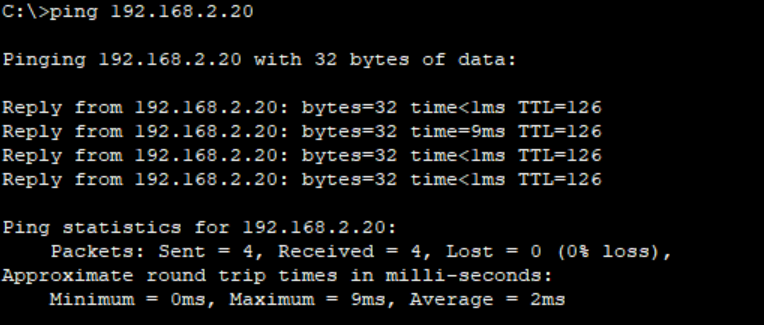

* Dosen Pengampu  
Tugas ini merupakan tugas mata kuliah Konsep Jaringan yang diampu oleh Dr. Ferry Astika Saputra ST, M.Sc ([@ferryastika](https://github.com/ferryastika)).

- Pada praktikum kali ini, kita akan mengirim ping antar komputer dalam sebuah topologi komputer yang dibuat menggunakan Cisco Packet Tracer.

- Setiap router memiliki dua antarmuka yang menghubungkan jaringan yang berbeda. 
- Router 1:
Antarmuka 0/0:
IP Address: 192.168.1.1
Subnet Mask: 255.255.255.0
Antarmuka 0/1:
IP Address: 10.0.1.1
Subnet Mask: 255.255.255.0
- Router 2:
Antarmuka 0/0:
IP Address: 192.168.2.1
Subnet Mask: 255.255.255.0
Antarmuka 0/1:
IP Address: 10.0.1.2
Subnet Mask: 255.255.255.0
- Setiap switch menghubungkan dua PC dalam jaringan yang sama.
- Switch 1:
PC1:
IP Address: 192.168.1.10
Subnet Mask: 255.255.255.0
PC2:
IP Address: 192.168.1.20
Subnet Mask: 255.255.255.0
- Switch 2
PC3:
IP Address: 192.168.2.10
Subnet Mask: 255.255.255.0
PC4:
IP Address: 192.168.2.20
Subnet Mask: 255.255.255.0

