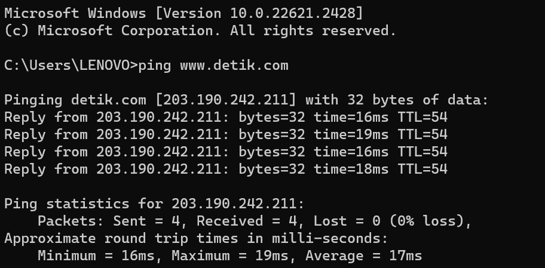
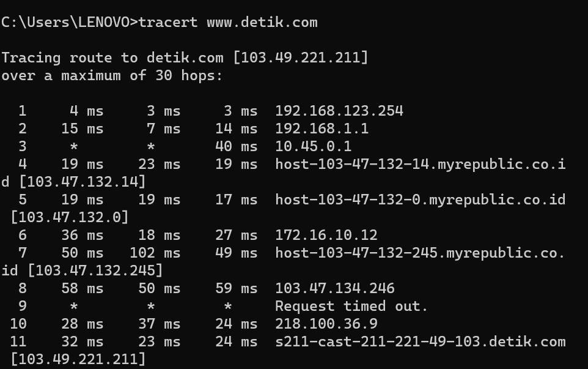

* Dosen Pengampu  
Tugas ini merupakan tugas mata kuliah Konsep Jaringan yang diampu oleh Dr. Ferry Astika Saputra ST, M.Sc ([@ferryastika](https://github.com/ferryastika)).

# PING
Perintah ping bekerja dengan cara mengirim paket ke alamat yang ditentukan, pengirim paket menunggu balasan dari alamat tersebut. Perjalanan paket dari mulai dikirim dan balik lagi ke pengirim memerlukan waktu. Makin cepat paket kembali ke pengirim, maka makin bagus koneksi antara pengirim dan tujuan. 

- Berikut adalah elemen-elemen utama saat menjalankan tes ping di cmd : 
1. Paket Data: Setiap kali Anda menjalankan tes ping, cmd mengirimkan serangkaian paket data ke alamat tujuan yang Anda tentukan. Paket data ini berisi informasi yang diperlukan untuk mengukur respons dari alamat tersebut.
2. Waktu (Time): Salah satu elemen yang paling penting dalam hasil ping adalah waktu (time) yang diperlukan untuk setiap paket data untuk pergi ke alamat tujuan dan kembali lagi ke komputer Anda. Ini diukur dalam milisecond (ms) dan menunjukkan berapa lama perjalanan pulang-pergi paket data tersebut.
3. TTL (Time To Live): TTL adalah nilai yang ditambahkan ke setiap paket data yang dikirim. Nilai ini menurun setiap kali paket data melewati perangkat jaringan seperti router. Jika TTL mencapai nol, paket data akan dibuang. Informasi TTL dapat memberikan gambaran tentang jumlah "langkah" atau router yang diperlukan untuk mencapai alamat tujuan.
4. Ukuran Paket: Ukuran paket data yang dikirimkan dalam tes ping dapat bervariasi. Biasanya, ukuran paket ping adalah 32 byte, tetapi ini dapat diubah sesuai preferensi atau kebutuhan pengguna.
5. Rute (Route): Hasil ping biasanya menampilkan rute yang diambil oleh paket data untuk mencapai tujuan. Ini adalah daftar alamat IP dari setiap perangkat jaringan yang dilalui paket data selama perjalanan.
6. Statistik: Setelah semua paket data telah dikirim dan diterima, cmd akan menampilkan statistik mengenai kecepatan, waktu minimum, waktu maksimum, dan rata-rata respons dari alamat tujuan.
7. Keterangan Kesalahan: Jika ada masalah dengan koneksi, Anda mungkin akan melihat keterangan kesalahan seperti "Request Timed Out" (Permintaan Waktu Habis), yang menunjukkan bahwa paket data tidak berhasil sampai ke tujuan dalam batas waktu yang ditentukan.
- Berikut percobaannya

# Analisa Ping

* Pinging detik.com [203.190.242.211] with 32 bytes of data: Ini adalah baris yang memberikan informasi tentang apa yang akan di-ping. Perintah akan mengirim paket data ke alamat IP203.190.242.211, yang sesuai dengan nama domain "detik.com." Setiap paket data memiliki ukuran 32 byte. 
* Reply from 203.190.242.211: bytes=32 time=16ms TTL=54: Ini adalah hasil dari ping yang pertama. Ini menunjukkan bahwa paket data telah dikirimkan dengan sukses ke alamat IP 203.190.242.211, dan Anda menerima balasan. Elemen-elemen berikut ini menjelaskan detailnya
* Ping statistics for 203.190.242.211: Ini adalah ringkasan statistik dari ping yang telah dilakukan

# Traceroute
Tracert adalah alat untuk melihat rute atau jalan yang digunakan oleh data ketika dikirim melalui internet. Saat Anda mengunjungi sebuah situs web, data Anda melewati beberapa perangkat jaringan. Tracert membantu Anda melihat daftar perangkat ini dan berapa lama data Anda sampai ke masing-masing perangkat.

- Berikut adalah elemen-elemen utama saat menjalankan tes tracert di cmd
1. Hop: Setiap langkah dalam perjalanan paket data dari komputer Anda ke alamat tujuan disebut sebagai "hop." Setiap hop mewakili perangkat jaringan seperti router yang ditemui oleh paket data dalam perjalanan menuju tujuan.
2. Waktu (Time): Seperti pada perintah "ping," waktu (time) di sini menunjukkan berapa lama dibutuhkan oleh setiap paket data untuk mencapai hop berikutnya. Ini diukur dalam milisecond (ms) dan menunjukkan latensi pada setiap hop.
3. Nama Host atau Alamat IP: Untuk setiap hop, Anda akan melihat nama host (jika tersedia) atau alamat IP perangkat jaringan yang ada di hop tersebut. Ini membantu Anda memahami jalur perjalanan data dan mengidentifikasi perangkat jaringan tertentu.
4. Hilang (Loss): Terkadang, paket data dapat hilang di salah satu hop, biasanya disebabkan oleh kelebihan lalu lintas, masalah jaringan, atau firewall yang memblokir respons. Anda akan melihat asterisk (*) atau waktu yang lebih lama untuk mengindikasikan paket data yang hilang.
5. Jarak (TTL - Time To Live): Seperti pada perintah "ping," nilai TTL menunjukkan berapa banyak hop yang ditemui oleh paket data sebelum mencapai tujuan akhir atau sebelum TTL mencapai nol. Hal ini membantu Anda melihat seberapa banyak perangkat jaringan yang ditemui dalam perjalanan.
6. Statistik: Setelah semua hop telah dilacak, cmd akan menampilkan statistik mengenai waktu minimum, maksimum, dan rata-rata respons pada setiap hop.
7. Keterangan Kesalahan: Jika ada hop yang tidak merespons atau mengalami masalah, Anda mungkin akan melihat keterangan kesalahan seperti "Request Timed Out" (Permintaan Waktu Habis).

- Berikut percobaannya

# Analisa Tracerout

* Hop 1: Paket data pertama kali mencapai gateway atau router di jaringan lokal Anda (192.168.123.254).
* Hop 2: Kemudian, paket data bergerak melalui jaringan ISP Anda (192.168.1.1).
* Hop 3:Di hop ini, Anda mungkin melihat beberapa waktu latency dan kegagalan paket. Ini bisa disebabkan oleh masalah di router atau server di sana (10.45.0.1).
* Hop 4: Ini adalah hop keempat, dengan alamat IP 103.47.132.14, yang juga merupakan bagian dari jaringan penyedia layanan internet Anda.
* Hop 5: Ini adalah hop kelima, dengan alamat IP 103.47.132.0, yang juga merupakan bagian dari jaringan penyedia layanan internet Anda.
* Hop 6: Hop keenam memiliki alamat IP 172.16.10.12, yang kemungkinan adalah salah satu hop dalam jaringan penyedia layanan internet atau server tujuan.
* Hop 7: Ini adalah hop ketujuh, dengan alamat IP 103.47.132.245, yang juga merupakan bagian dari jaringan penyedia layanan internet Anda.
* Hop 8 : Hop kedelapan memiliki alamat IP 103.47.134.246, yang kemungkinan adalah salah satu hop dalam jaringan penyedia layanan internet atau server tujuan.
* Hop 9 : Hop kesembilan menunjukkan "Request timed out," yang berarti tidak ada respons dari hop ini. Ini bisa terjadi karena hop ini diatur untuk tidak merespons permintaan ICMP, atau ada masalah konektivitas di sana.
* Hop 10 : Hop kesepuluh memiliki alamat IP 218.100.36.9, yang kemungkinan adalah salah satu hop dalam jaringan penyedia layanan internet atau server tujuan.
* Hop 11 : Hop kesebelas menunjukkan alamat IP 103.49.221.211, yang sesuai dengan tujuan akhir, yaitu "s211-cast-211-221-49-103.detik.com."
