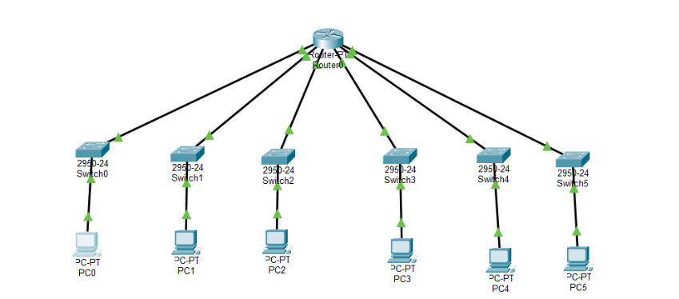
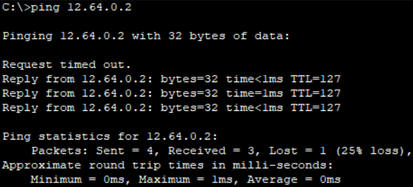
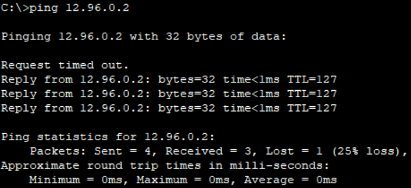
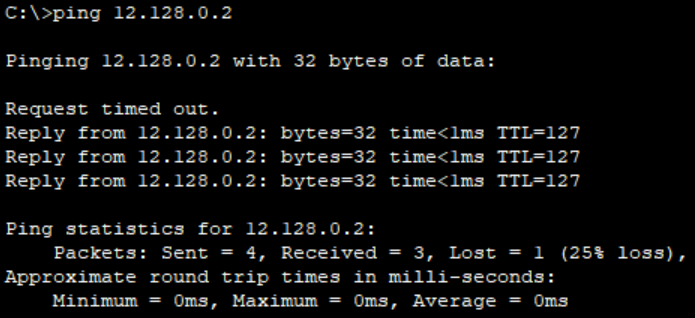
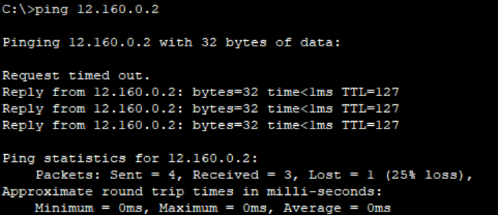
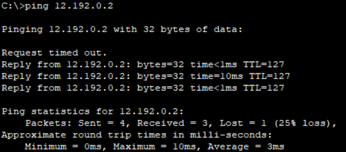

* Dosen Pengampu  
Tugas ini merupakan tugas mata kuliah Konsep Jaringan yang diampu oleh Dr. Ferry Astika Saputra ST, M.Sc ([@ferryastika](https://github.com/ferryastika)).

# Konfigurasi Jaringan | 6 Subnet

praktikum ini, kita akan menggunakan 1 Route, 6 Switch dan 6 PC pada alamat IP publik 12.0.0.0/8.

# Ket Configurasi
1. Router:
* FastEthernet(Fa) 0/0 : 12.32.0.1
* FastEthernet(Fa) 1/0 : 12.64.0.1
* FastEthernet(Fa) 6/0 : 12.96.0.1
* FastEthernet(Fa) 7/0 : 12.128.0.1
* FastEthernet(Fa) 8/0 : 12.160.0.1
* FastEthernet(Fa) 9/0 : 12.192.0.1
2. PC:
* PC0:
- IP Address: 12.32.0.2
- Subnet Mask: 255.224.0.0
- Gateway: 12.32.0.1
* PC1:
- IP Address: 12.64.0.2
- Subnet Mask: 255.224.0.0
- Gateway: 12.64.0.1
* PC2:
- IP Address: 12.96.0.2
- Subnet Mask: 255.224.0.0
- Gateway: 12.96.0.1
* PC3:
- IP Address: 12.128.0.2
- Subnet Mask: 255.224.0.0
- Gateway 12.128.0.1
* PC4:
- IP Address: 12.160.0.2
- Subnet Mask: 255.224.0.0
- Gateway 12.160.0.1
* PC5:
- IP Address: 12.196.0.2
- Subnet Mask: 255.224.0.0
- Gateway 12.196.0.1

# Hasil Test Ping
- Pc 0 ke 1

- Pc 0 ke 2

- Pc 0 ke 3

- Pc 0 ke 4

- Pc 0 ke 5

